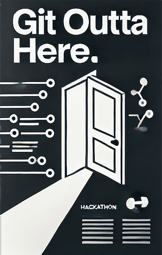

# Web 3 Hackathon: Git Outta Here.

Welcome to the very first Web 3 hackathon! 

Today's challenge is to create an interactive digital escape room. As digital designers, we'll use our favorite tools: HTML, CSS, JavaScript, and Git.

[Let's git ready to rumble!](https://www.youtube.com/watch?v=nendMLrpI-s)


## Challenge 0: Team Up!
Divide yourselves into teams of **three**. 

## Challenge 1: Set Up Repository (1 per team)
One team member should complete the following steps:
### 1. Create a Repository 
Create a new repository named after your project or team.

### 2. Create a README.md File
In your repository, create a README.md file.

Include the names of all team members.

Example:

```markdown
# Team Devine

- Alice Smith 
- Bob Johnson 
- Charlie Lee 
```

### 3. Commit and Push
Add and commit the README.md file to your local repository.

Push the commit to GitHub.

### 4. Share Your Repository URL
Provide the URL of your GitHub repository via [this form](https://forms.gle/VHo5o13paYTLBANU8).

