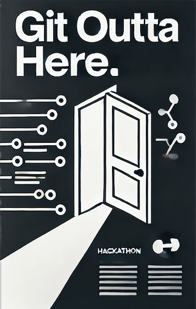
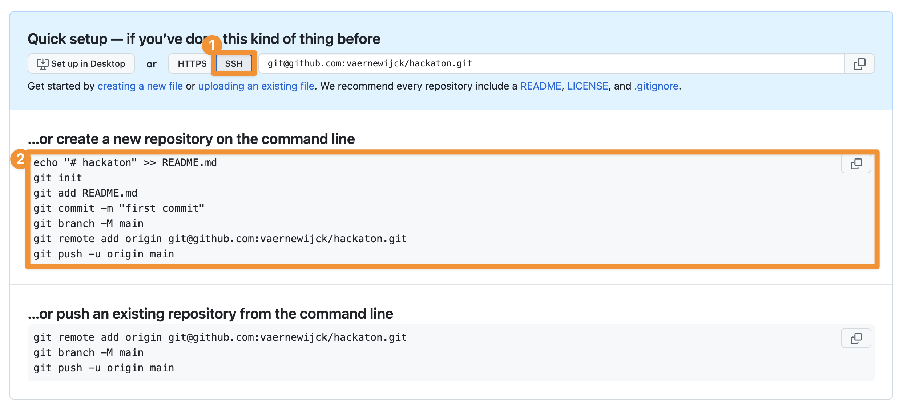
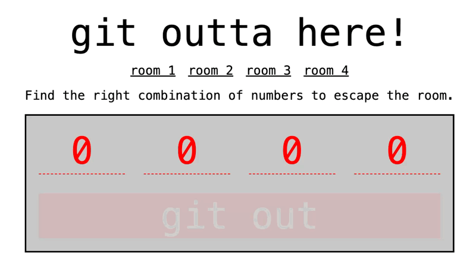

# Web 3 Hackathon

Welcome to the very first Web 3 hackathon! 

Today's challenge is to create an interactive digital escape room. As digital designers, we'll use our favorite tools: HTML, CSS, JavaScript, and Git.

[Let's git ready to rumble!](https://www.youtube.com/watch?v=nendMLrpI-s)


## CHALLENGE 0: Team Up!
Divide yourselves into teams of **three**. 

## CHALLENGE 1: Set Up Repository (1 per team)
One team member should complete the following steps:
### 1. Create a Repository 
Create a new repository named after your project or team on GitHub.

You don't have to add a README.md file yet.

Be sure to select SSH as the URL type.

Create a new folder on your machine. Initialize the repository with a README.md file.



[Create repository & first push](https://devinekask.github.io/workflows/git/collaboration/collab-01-github-push/#create-repository--first-push)

### 2. Create a README.md File
In your repository, create a README.md file.

Include the names of all team members.

Example:

```markdown
# Team Devine

- Alice Smith 
- Bob Johnson 
- Charlie Lee 
```

### 3. Commit and Push
Add and commit the README.md file to your local repository.

Push the commit to GitHub.

[Create repository & first push](https://devinekask.github.io/workflows/git/collaboration/collab-01-github-push/#create-repository--first-push)

#### Push
To push you can use the following commands to set the upstream:

```bash
git push -u origin main 
```

Afterwards you can use the following command to push:

```bash
git push
```

#### Pull
To pull you can use the following commands:

```bash
git pull origin main --rebase
```

### 4. Adding Collaborators
Add your team members as collaborators to the repository.

Make your repository public.

[Adding a collaborator to a repository](https://docs.github.com/en/account-and-profile/setting-up-and-managing-your-github-user-account/managing-access-to-your-personal-repositories/inviting-collaborators-to-a-personal-repository)

### 5. Share the URL
Provide the URL of your GitHub repository via [this form](https://forms.gle/VHo5o13paYTLBANU8).

The leaderboard will be updated every 10 minutes.

[leaderboard](https://repo-leaderboard.pages.dev/)

## CHALLENGE 2: Setup project
To save some time, we will provide you with a basic HTML and CSS template.



One team member should complete the following steps:

### 1. HTML

Create an index.html file in your repository.

Add the following code to your index.html file. As you can see, the code includes a form with four input fields. Each input field has a pattern attribute that specifies the correct number for that field. This will be the combination to escape the room.

```html
  <main>
    <h1>git outta here!</h1>
    <nav>
      <ul>
        <li><a href="#">room 1</a></li>
        <li><a href="#">room 2</a></li>
        <li><a href="#">room 3</a></li>
        <li><a href="#">room 4</a></li>
      </ul>
    </nav>
    <p>
      Find the right combination of numbers to escape the room.
    </p>

    <form action="https://shorturl.at/7mHvR">
      <input type="text" pattern="1" placeholder="0" required size="1">
      <input type="text" pattern="2" placeholder="0" required size="1">
      <input type="text" pattern="3" placeholder="0" required size="1">
      <input type="text" pattern="4" placeholder="0" required size="1">
      <button type="submit">git out</button>
    </form>
  </main>
```

### 2. CSS
Add a CSS file to your repository. 

Add the following code to your CSS file:

```css
:root {
  --error: #ff0000;
  --primary: #000000;
  --primary-light: #c9c9c9;
}

::selection {
  background-color: var(--primary);
  color: white;
}

body {
  height: 100vh;
  font-family: monospace;
  font-size: 1rem;
  display: grid;
  place-items: center;
  gap: 1rem;
}

main {
  display: flex;
  flex-direction: column;
  justify-content: center;
  text-align: center;
  gap: 1rem;
}

h1 {
  font-size: 3rem;
}

ul {
  list-style: none;
  padding: 0;
  display: flex;
  justify-content: center;
  gap: 1rem;
}

a {
  color: var(--primary);
}

input {
  background: none;
  border: none;
  font-size: inherit;
  font-family: inherit;
  border-bottom: dashed 1px var(--primary);
  text-align: center;
}

input:focus {
  outline-color: var(--primary);
}

input::placeholder {
  color: var(--error);
}

form {
  display: grid;
  grid-template-columns: repeat(4, 1fr);
  justify-content: center;
  gap: 0.5em;
  font-size: 3rem;
  border: solid 2px var(--primary);
  padding: 1rem;
  background-color: var(--primary-light);
}

button {
  grid-column: 1 / -1;
  background: var(--primary);
  border: none;
  color: white;
  font-family: inherit;
  font-size: inherit;
}

button:focus {
  outline: solid 1px var(--primary);
}

input:invalid {
  color: var(--error);
  border-color: var(--error);
}

form:has(:invalid) button {
  opacity: 0.1;
  background-color: #ff0000;
}
```
### 3. Commit and Push
Add and commit the index.html and CSS files to your local repository.

Push the commit to GitHub.

Make sure that everyone in your team has access to the repository and pulls the latest changes.

## CHALLENGE 3: Rooms

Now it's time to create the rooms. Each room should have a unique challenge that reveals one of the numbers of the final combination.

Every team member should work on at least one room.

[Branching](https://devinekask.github.io/workflows/git/basics/git-06-branches/)

[Track and commit](https://devinekask.github.io/workflows/git/basics/git-03-commit/)

### Requirements:
- Each room should have a separate HTML  and CSS file.
- Each room should have a separate git branch.
- You can use a shared CSS file for all rooms. For example for:
  - fonts
  - colors
  - spacers
  - visually hidden
  - border box
  - ...

### Hiding numbers
 To hide the numbers, keep it simple and basic. For example:
- hover effects
- css animations
- js events
- timers
- colors
- ...

Do not waste any time on creating assets. Use AI generated images or images you found on the internet.


## CHALLENGE 4: Final Touches

### Merge Branches
Merge all branches into the main branch.

###  Update README.md
Update the README.md file in the main branch so that it includes the following information:
- The names of all team members.
- A description of the project.
- A screenshot of the final project.
- Hints for each room.

Every team member should add a section to the README.md file that describes the room they created.

[Markdown Cheatsheet](https://www.markdownguide.org/cheat-sheet/)

### Homepage
Do not forget to update the index.html file to include links to all rooms and or update it to your specific needs.

## CHALLENGE 5: Deploy
Before we used to deploy our projects using Combell and FileZilla. But now we will use GitHub Pages. This is a free service that turns your GitHub repository into a website.

Follow [this tutorial](https://docs.github.com/en/pages/quickstart).  Of course you don't have to do the first step, because you already have a repository. You can start from step 6.

You can now share your project with the world!

If the index.html is not in the root folder of your repository, you will have to add the folder name to the URL. For example: https://username.github.io/repositoryname/foldername

For example:
- [https://devinekask.github.io/git-outta-here/](https://devinekask.github.io/git-outta-here/) serves the README.md file in the root folder of the repository.
- [https://devinekask.github.io/git-outta-here/template](https://devinekask.github.io/git-outta-here/template) serves the index.html file in the template folder of the repository.

## Award Ceremony
Info will follow.

